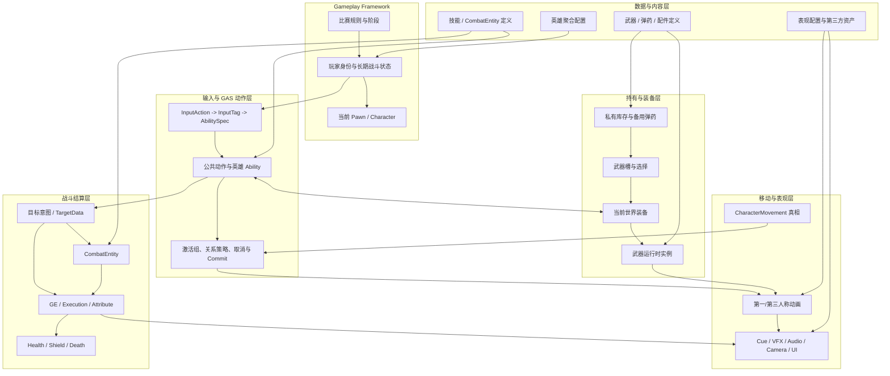
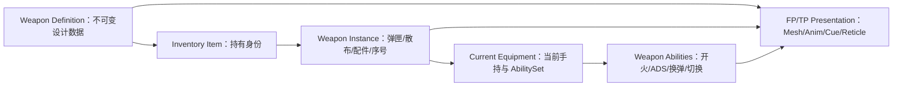
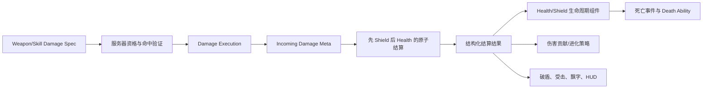
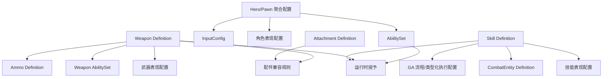

# Apecox 多人英雄射击战斗框架架构 RFC

状态：框架研究稿，待用户逐项审阅  
日期：2026-08-05  
适用版本：Unreal Engine 5.8  
文档层级：架构级，不包含 Apecox 类名、函数、成员字段、文件布局、最终 GameplayTag 或资产字段设计

---

## 1. 执行摘要

Apecox 的目标不是把所有枪械和技能塞进一个万能 GameplayAbility，也不是复制 Lyra 的完整工程体系。推荐方向是建立一套**分层但可纵向验证**的多人英雄射击框架：

1. Gameplay Framework 管理玩家身份、匹配规则、Pawn 生命周期和网络存在范围。
2. 玩家 ASC 由 PlayerState 持有，当前 Character/Pawn 作为 Avatar；绑定与解绑必须成对出现。
3. GAS 负责可激活战斗动作、资源与冷却、状态关系、伤害/恢复结果、异步 AbilityTask 和表现入口；它不独占库存、武器实例、移动物理或动画状态机。
4. 库存、武器槽和当前装备是不同运行时真相：私有持有状态属于玩家生命周期，当前可见装备属于 Pawn 生命周期。
5. 武器采用“静态定义 + 可复制运行时实例 + 装备能力包 + 第一/第三人称表现”的混合结构；开火、ADS、换弹和切枪通过 GAS 参与仲裁，但弹匣、散布、配件和射击序号由武器运行时拥有。
6. 弹药类型独立于武器类别；配件通过受约束的槽位、兼容规则和类型化数值修改进入武器统计聚合，不修改静态定义。
7. Health、Shield、MaxShield 和 EvolutionProgress 适合作为 GAS 可观察数值；ShieldTier 优先由进化进度和模式阈值推导，避免两份可写真相。
8. 英雄技能采用“GA 基类能力 + 稳定流程模板 + AbilityTask/可替换策略 + CombatEntity + 必要时专用 GA”的扩展阶梯，不采用任意 Step 解释器。
9. 本地第一人称与远端第三人称共享一次权威战斗行为，但使用两套表现通道。Apecox V1 推荐第一人称 Arms/Weapon 表现加世界空间全身角色；是否升级为本地可见完整身体留待资产验证。
10. 滑铲物理和网络预测归 CharacterMovement；GAS 只负责资格、消耗、打断和跨系统状态。完整预测滑铲应进入 V1 后段里程碑，而不是用 Ability Tick 临时实现。
11. 所有伤害、库存转移、弹药结算、装备切换和 CombatEntity 生成由服务器给出最终结果。本地预测只负责即时响应，并必须可以被确认、拒绝或纠正。
12. 首个开发闭环应是“出生为空手 -> 拾取一把步枪 -> 第一/第三人称开火 -> 换弹 -> 丢弃 -> 死亡/复活”，之后再增加第二弹药类型、配件、护盾、特殊技能和滑铲。

### 1.1 非目标

本 RFC 不设计：

- 完整大逃杀、大地图、缩圈、经济、排名、AI 或完整英雄阵容。
- Apecox 的具体 C++ API、类名、函数签名、成员变量或文件目录。
- 最终 GameplayTag 树、DataAsset 字段表、RPC 参数或 AnimGraph 节点。
- 商业级反作弊、完整 Server-Side Rewind、跨服库存或断线重连方案。
- 技能编辑器和任意技能 Step VM。
- 每一种武器、配件、伤害类型和动作关系的最终玩法数值。

---

## 2. 产品能力边界

### 2.1 已确认范围

- 小规模多人 PvP，当前没有 AI 战斗。
- 玩家出生为空手，通过世界拾取获得武器、弹药、配件和消耗品。
- 公共枪械系统首批容纳步枪、霰弹枪和狙击枪。
- 弹药资源与武器类别解耦。
- 英雄拥有小技能、大招和可能存在的被动能力。
- Health、可进化 Shield、恢复、死亡和复活形成完整闭环。
- 本地第一人称、远端第三人称均要正确。
- 特殊技能可以生成临时武器、投射物、场、无人机等战斗载体。
- 网络权威、预测、延迟、丢包和 Dedicated Server 都属于验收范围。
- 滑铲和滑铲跳需要有正确的架构归属。

### 2.2 作为压力条件而非当前详细需求的内容

以下行为用于检验框架是否能扩展，不代表已经批准其具体规则：

- 两个普通武器槽已确认；槽位替换、背包容量、技能临时装备和死亡掉落的精确散布规则仍待讨论。
- 1x、2-4x、6-8x 的具体瞄具交互。
- 霰弹枪逐发装填、拉栓狙击、弓箭蓄力等特殊动作语义。
- 电池恢复采用完成时一次结算还是持续结算，以及持续时间、资源消耗点和取消结果。
- 空中开火、滑铲时换弹、技能打断武器等动作关系。
- 伤害部位、爆头、护甲穿透、友伤和复杂抗性。

这些内容应在对应专题中决定，框架只需提供明确的接入位置。

---

## 3. 证据、推断与 Apecox 取舍

### 3.1 证据等级

1. UE 5.8 和 Lyra 实际源码。
2. Epic 官方文档和官方模板。
3. 已保存的 Lyra、GAS、动画和技能架构资料。
4. 现有课程资产与蓝图，只用于参考或表现验证。
5. Apex Legends 官方公开的玩法行为，只用于产品语义，不推断其内部代码。

### 3.2 关键事实表

| 类型 | 已确认内容 | 架构影响 |
| --- | --- | --- |
| Lyra 源码事实 | ASC 位于 PlayerState，Pawn 作为 Avatar；PawnData 授予 AbilitySet | Apecox 保留 PlayerState Owner/Pawn Avatar 与可撤销授予思想 |
| Lyra 源码事实 | AbilitySet 同时授予 GA、GE、AttributeSet，并记录撤销句柄 | AbilitySet 只做授予包，不做技能定义或运行时状态 |
| Lyra 源码事实 | InputTag 保存于 AbilitySpec 的动态来源标签，ASC 每帧统一处理 Pressed/Held/Released | 输入不直接绑定具体技能或武器类 |
| Lyra 源码事实 | Inventory 和 QuickBar 位于 Controller 侧，Equipment 位于 Pawn 侧 | 私有持有状态与当前世界装备可以分离 |
| Lyra 源码事实 | EquipmentInstance 可授予 AbilitySet 并生成附着 Actor，卸下时成对撤销 | 当前装备可以成为武器能力和表现的生命周期边界 |
| Lyra 源码事实 | RangedWeaponInstance 拥有热量、散布、射击参数；射击 GA 构造 TargetData | 武器状态与 GA 流程应混合协作，不应互相吞并 |
| Lyra 源码事实 | 射击示例中的 TargetData 有客户端到服务器链路，但 `bIsTargetDataValid` 恒为 true，项目中未找到命中替换实现 | 学习数据流，不把 Lyra 样例当成完整服务器校验或反作弊 |
| Lyra 源码事实 | HealthSet 使用 Damage/Healing Meta Attribute；HealthComponent 把归零转换为死亡事件；Death GA 执行排他死亡流程 | 数值结算、角色生命周期和表现应分层 |
| Lyra 源码事实 | Lyra 没有实现可复用 Shield 层，Shield 只出现在注释示例 | Apecox 的护盾与进化必须自建设计 |
| Lyra 源码事实 | Lyra CMC 没有现成滑铲自定义移动 | Apecox 需自己实现预测移动，不能声称沿用 Lyra |
| Epic 官方事实 | GAS 支持本地预测 Ability、PredictionKey、GameplayEffect/Tag/Cue 的部分回滚，但 Instant Damage 等不能简单回滚 | 本地反馈可预测，最终伤害必须服务器结算 |
| Epic 官方事实 | CMC 通过 SavedMove、服务器重演和校正支持网络移动；MOVE_Custom/PhysCustom 用于自定义物理 | 滑铲归 CMC，不归 GA Tick |
| Epic 官方事实 | Linked Anim Layers 可按武器切换动画层并独立加载 | 动画按基础 Locomotion、武器家族和特殊 Montage 分层 |
| Epic 官方事实 | UE 5.8 First Person Rendering 支持本地专用 FOV、抗穿模和 World Space Representation | 第一/第三人称可以共享世界角色但分离本地表现几何 |
| 资产事实 | Stephen_FPS 是 UE 5.7 纯内容工程；其余资产主要为武器、第一/第三人称动作和 FBX | 资产可以验证表现，不能作为代码架构权威 |

### 3.3 Apecox 自主取舍

- 不采用 Lyra 完整 Experience、GameFeature 和四级 InitState。
- 不采用客户端命中结果直接作为服务器真相。
- 不在第一版启用 Iris 特有架构；使用兼容 Registered Subobject/FastArray 的边界。
- 不先造万能配置、万能 GA 或技能时间线解释器。
- 先做可演示的纵向闭环，再按压力场景增加基础设施。

---

## 4. 总体分层



### 4.1 唯一真相原则

| 真相 | 唯一拥有者 | 其他系统如何使用 |
| --- | --- | --- |
| 玩家身份、ASC、跨 Pawn 战斗属性 | PlayerState | Pawn 绑定为 Avatar；UI 和规则订阅 |
| 私有库存、备用弹药、槽位物品 | 玩家私有生命周期对象 | 当前装备从中选择；远端只看必要摘要 |
| 当前可见装备 | Pawn 的装备运行时 | GA、动画、远端表现查询 |
| 弹匣、散布、配件、射击序号 | WeaponInstance | GA 在 Commit/Targeting 时读取和修改 |
| 移动位置、速度、滑铲物理 | CharacterMovement | GAS 门控，动画观察 |
| Health/Shield 数值 | ASC 中的 AttributeSet | 结算组件翻译成事件与生命周期 |
| 世界投射物、无人机、场 | 对应 CombatEntity Actor | GA 只创建和传递来源，不持续承载其生命期 |
| 第一/第三人称动画和 VFX | Presentation 层 | 只消费战斗事实，不决定最终伤害或库存 |

任何新功能若要求两个系统同时写同一真相，应先修正边界，而不是增加同步补丁。

---

## 5. Gameplay Framework 与网络存在范围

### 5.1 存在与职责矩阵

| 角色 | Dedicated Server | Listen Server 主机 | Owning Client | Remote Client | 主要职责 |
| --- | --- | --- | --- | --- | --- |
| GameMode | 有 | 有 | 无 | 无 | 权威匹配规则、出生、死亡后的重生策略 |
| GameState | 有 | 有 | 有 | 有 | 复制比赛阶段、队伍分数和公共目标状态 |
| PlayerController | 每位玩家一个 | 每位玩家一个，主机还有本地视角 | 仅自己的 | 无 | 私有输入、交互请求、本地 UI、私有库存候选所有者 |
| PlayerState | 每位玩家一个 | 每位玩家一个 | 所有玩家的实例 | 所有玩家的实例 | 玩家身份、ASC、公共战斗状态和跨 Pawn 数据 |
| Character/Pawn | 权威实例 | 权威及主机本地表现 | Autonomous Proxy | Simulated Proxy | 位置、碰撞、移动、当前装备和世界表现 |
| HUD/Camera/第一人称表现 | 无 | 仅主机本地 | 有 | 无 | 本地视图与反馈，不保存权威战斗真相 |

### 5.2 ASC 所有权

推荐：

```text
OwnerActor  = PlayerState
AvatarActor = 当前 Character/Pawn
```

理由：能力、属性和部分长期状态可以跨死亡/重生存在；Pawn 仍负责身体、移动和碰撞。Lyra 已以此方式运行，Apex 旧项目也完成了单/多人验证。

替代方案：ASC 放在 Character。实现更直接，但死亡换 Pawn 时必须重建并迁移 Ability、Attribute、GE 和 UI 订阅，容易把“角色死亡”误当成“玩家状态销毁”。

改变条件：若未来明确采用每次换 Pawn 就完全换一套独立能力和属性，且没有跨 Pawn 状态，才重新评估 Character Owner。

### 5.3 轻量初始化协议

Apecox 不复制 Lyra 完整四阶段 InitState，但必须保留成对协议：

1. 服务器确定 PlayerState、Controller 和 Pawn 关系。
2. 服务器与拥有客户端在依赖就绪后绑定 ASC ActorInfo。
3. 应用英雄聚合配置、关系策略和可撤销 AbilitySet。
4. 初始化输入、动画对 ASC 的观察和 Health/Shield 订阅。
5. 死亡或换 Pawn 时，取消不应存活的 Ability、清输入、清临时 Cue、卸下装备、解绑 Avatar。
6. 新 Pawn 就绪后重新绑定；哪些 Attribute、GE、Ability 保留由模式策略决定。

替代方案：完整照搬 Lyra ModularGameplay。它支持 GameFeature 动态注入，但会引入当前不需要的组件管理、Experience 和初始化复杂度。

改变条件：出现运行时装卸英雄模块、GameFeature 插件或多种异步 Pawn 注入来源时，再升级初始化状态机。

### 5.4 ASC 复制模式

玩家控制的 ASC，V1 推荐使用 **Mixed Replication Mode**：

- 拥有客户端需要收到自身完整 Active GameplayEffect，以正确显示冷却、持续 Buff、消耗和预测确认。
- 其他客户端通常只需要由 GE 导出的 GameplayTag、GameplayCue 和显式公开 Attribute，不需要收到该玩家的完整 GE 容器。
- 这与 Lyra 的玩家 ASC 选择一致，也符合 PlayerState Owner/Pawn Avatar 的所有权前提。

替代方案 A：Full。调试最直观，但会把所有玩家的 Active GE 广泛复制，人数和持续效果增加后带宽成本更高。

替代方案 B：Minimal。适合不需要拥有客户端完整 GE 信息的简单 AI 或非玩家 Actor，不适合 Apecox 玩家 HUD、冷却和预测需求。

改变条件：如果后续证明远端 UI/观战必须读取完整 Active GE，先设计公开摘要；只有摘要无法满足时才评估 Full，而不是直接放大 ASC 复制。

### 5.5 死亡与重生

推荐顺序：

```text
服务器伤害结算 -> Health 归零 -> 死亡事件 -> 排他死亡动作
-> 取消战斗动作 -> 清理/掉落装备 -> 结束 Pawn 表现
-> GameMode 决定重生 -> 解绑旧 Avatar -> 创建并绑定新 Avatar
-> 按模式恢复或清空库存/护盾进度 -> 以空手状态进入游戏
```

“复活为空手”是当前原型默认策略，但应由模式规则执行，不应通过销毁 PlayerState 或把库存绑死在 Character 来偶然实现。

---

## 6. GAS 基础与非 GAS 边界

### 6.1 GAS 各机制的职责

| 机制 | 负责 | 不负责 |
| --- | --- | --- |
| ASC | Ability、GE、Attribute、Tag、Cue、PredictionKey 和 ActorInfo | 世界库存、武器 Mesh、移动物理 |
| GameplayAbility | 一次可激活战斗动作的资格、Commit、异步流程、取消与结束 | 永久保存弹匣、无人机或场的完整生命期 |
| AbilitySet | 成组授予/撤销 Ability、GE、AttributeSet 和输入槽 | 定义一个技能的全部数据或运行时状态 |
| GameplayEffect | 数值、持续时间、周期、层数、可预测状态和 Cue 关联 | 拾取物所有权、枪械 Mesh、复杂世界检测 |
| ExecutionCalculation | 服务器最终伤害/恢复公式和 Meta Attribute 输出 | 播放动画、死亡销毁、UI |
| AttributeSet | 保存和约束 GAS 数值，接收 Meta 结算 | 直接生成世界 Actor 或驱动表现流程 |
| GameplayTag | 跨系统稳定语义、资格与关系查询 | 每个资产 ID、一次临时流程结果、连续数值 |
| GameplayEvent | 关键语义事件及携带上下文 | 任意系统的通用消息总线 |
| AbilityTask | GA 内可取消、可清理的异步工作 | 为同步函数或普通 Spawn 强行包壳 |
| GameplayCue | 可复制/可预测的视觉、声音、镜头和 HUD 反馈入口 | 权威伤害、目标选择和库存结算 |

### 6.2 输入路由

```text
键盘 / 鼠标
  -> InputAction
  -> InputTag（槽位或意图）
  -> AbilitySpec
  -> ASC 统一处理 Pressed / Held / Released
```

这允许英雄技能、装备武器和临时大招按当前装配替换同一输入意图，不要求 Character 保存每个具体技能的 InputAction 成员。

### 6.3 Ability 并发和关系

推荐采用两层：

- 粗粒度激活组解决 Independent、可替换排他、阻塞排他。
- Tag Relationship Policy 集中表达某类 Ability 对眩晕、死亡、换弹、装备切换等稳定状态的额外要求、阻止和取消关系。

不能只靠一个巨大枚举，因为状态可以正交组合；也不能给每个技能临时发明关系 Tag。

### 6.4 共享 GA 的边界

GAS 原生 Ability AssetTags 主要来自 GA 类 CDO。同一个共享 GA 类承载多个 SkillDefinition 时，不能假设每个 AbilitySpec 的来源标签会自动参与全部原生阻止/取消判断。

推荐阶梯：

1. 同一生命周期和关系：共享 GA，通过类型化配置变化参数。
2. 局部异步行为不同：使用 AbilityTask 或可替换策略。
3. 总流程相同但少量稳定语义点不同：受控虚钩子或派生模板。
4. 生命周期、网络策略或关系显著不同：专用 GA。

产生一个专用 GA 不是架构失败。失败是因为缺少合理扩展点，迫使每个技能复制公共流程。

替代方案：实现完整 Spec-aware Policy，让同一 GA 下每个 Spec 拥有不同关系。它更灵活，但会改写 GAS 原生关系口径并增加多人验证成本。

改变条件：出现至少两个真实技能必须共享同一流程类、又必须拥有不同关系策略时，再专题设计 Spec-aware Policy。

---

## 7. 拾取、库存、装备与槽位

### 7.1 四个不同概念

| 概念 | 回答的问题 | 生命周期与复制 |
| --- | --- | --- |
| 世界拾取物 | 地图上哪里有一个可被获取的对象 | 服务器 Actor；向相关客户端复制 |
| 库存条目 | 玩家拥有什么、数量和实例状态 | 服务器真相；主要复制给拥有客户端 |
| 武器槽/选择 | 哪个库存条目被放入可切换槽，当前选择哪个 | 服务器真相；完整信息给 Owner，公共摘要按需复制 |
| 当前装备实例 | Pawn 手中现在是什么，它授予什么能力和显示什么 | Pawn 生命周期；对相关客户端复制 |

### 7.2 推荐所有权

- 私有库存、备用弹药和武器槽：放在服务器与拥有客户端都存在、且跨 Pawn 存活的玩家私有生命周期层。PlayerController 侧是 V1 首选，因为远端没有该 Controller，天然减少私有信息复制；这是 Lyra 的方向。
- PlayerState：保存 ASC、属性和需要被其他玩家观察的公共状态，不复制完整背包。
- Pawn：保存当前装备及其世界表现，因为远端必须看到当前持枪和切换结果。

替代方案 A：库存放 PlayerState。更符合某些持久化与观战查询，但 PlayerState 对所有客户端存在，必须更谨慎地做 Owner-only 数据和公共摘要分离。

替代方案 B：库存放 Pawn。最简单，但把持有状态与身体死亡绑死；未来保留物品、换 Pawn、观战或重连时迁移成本高。

改变条件：若明确要求队友/观战者查看完整背包、跨 Controller 迁移或复杂重连持久化，应重新评估 PlayerState 或独立玩家数据服务。

### 7.3 权威交易

拾取和丢弃是服务器原子事务：

```text
客户端发出交互意图
-> 服务器验证距离、视线、对象有效、容量和并发占用
-> 服务器把世界物转为库存条目
-> 必要时放入槽并装备
-> 复制私有库存与公共装备结果
```

失败时世界物不能消失，库存不能部分增加。重复请求必须由同一交互序号或服务器状态保证幂等。

### 7.4 槽位数量

槽位数量属于英雄/模式规则，不写死在武器或库存定义。当前是否固定两把武器仍为待讨论；框架只保证空槽、选择、切换、替换和清理可配置。

---

## 8. 武器框架

### 8.1 推荐混合模型



### 8.2 各层职责

**Weapon Definition**

保存不可变的武器设计身份、武器家族、弹药定义引用、基础射击模型、可装配范围和表现入口。它不是运行时对象，不随配件安装被修改。

**Weapon Instance**

保存单把枪的可变状态：当前弹匣、热量/散布、配件实例、可变倍率选择、射击序号和需要跨装备保留的武器状态。它可以成为 GA 的 SourceObject。

**Current Equipment**

表示 Pawn 正在手持什么，负责授予/撤销武器 AbilitySet、创建世界武器表现并与动画层协作。

**Weapon Ability**

处理输入驱动、激活资格、动作仲裁、预测窗口、Commit、TargetData、Montage/Task、取消和结束。

**Presentation**

处理本地第一人称 Mesh/动画、远端第三人称 Mesh/动画、枪口、弹壳、音效、准星、后坐力镜头和命中反馈。

### 8.3 为什么不把武器全塞进 GA

GA 是一次激活流程；WeaponInstance 要跨多次开火、换弹、收枪和重新装备持续存在。若弹匣、热量、配件和散布都存在 GA 中，GA 结束后状态归属不清，切枪和复制困难。

### 8.4 为什么也不把动作全塞进 Weapon Actor

开火、换弹、ADS 和切枪需要 GAS 的预测、Commit、成本、Tag 关系、取消和 AbilityTask。若武器 Actor 自己维护另一套动作状态机，会与英雄技能、死亡、眩晕和消耗品发生双重仲裁。

### 8.5 普通武器复用

步枪、霰弹枪和狙击枪共享：

- 装备/卸下生命周期。
- 输入与关系策略。
- 开火资格、射速和弹药 Commit 骨架。
- TargetData 传输与服务器结算入口。
- 第一/第三人称表现事件。

差异由受约束策略承担：

- Hitscan、Projectile 或混合弹道。
- 单发、连发、自动射击。
- 单弹丸或每发多弹丸。
- 普通弹匣、逐发装填、拉栓或蓄力。
- 散布、后坐力、距离衰减和特殊命中语义。

若差异只是参数，复用同一流程；若出现可复用的新射击/装填语义，增加策略或流程模板；若整个生命周期不同，使用专用 Ability。不要为每一把枪派生完整逻辑，也不要把所有差异写成布尔开关。

---

## 9. 弹药、瞄具与配件

### 9.1 WeaponType 与 AmmoType 解耦

```text
Weapon Family  -> 动画、姿态、部分行为家族
Ammo Definition -> 独立资源身份、世界拾取和库存堆叠
Weapon Definition -> 明确引用它所消耗的 Ammo Definition
```

因此两把同为 Rifle 的武器可以分别消耗 Light Ammo 和 Energy Ammo；霰弹枪也不因 Weapon Family 自动决定 AmmoType。

### 9.2 弹药真相

- 弹匣内数量：WeaponInstance。
- 备用弹药：私有库存。
- 世界弹药：服务器世界拾取物。
- 换弹：一个可取消的武器 Ability，在权威语义阶段把备用弹药转入弹匣。

不推荐把所有弹药做成玩家 Attribute。弹药是离散物品和特定武器实例状态，通常不需要任意 GE 修改、公共复制或跨英雄计算。若未来出现全局“无限弹药”Buff，可以通过规则/Tag/成本策略改变消耗，而不是迫使所有弹药成为 Attribute。

### 9.3 配件

推荐配件模型：

```text
不可变武器基础值
+ 已安装配件提供的类型化 Modifier
+ 临时英雄/状态 Modifier
= WeaponInstance 的有效统计结果
```

- 配件有明确槽位与兼容规则。
- 配件安装关系属于 WeaponInstance，不修改 Weapon Definition。
- 有效统计在来源改变时重算/失效，不每帧遍历所有资产。
- Modifier 使用受约束的统计键和运算语义，不用无限 GameplayTag 代替字段，也不直接运行任意脚本。
- Hero Buff 若需要跨系统参与，可作为一个临时 Modifier Provider 或通过稳定 Attribute/Tag 影响聚合；具体优先级后续专题决定。

替代方案：所有配件都应用 GE。它适合角色 Attribute Buff，但对单把 WeaponInstance 的弹匣、散布和后坐力会引入错误所有权和额外 ASC 复杂度。

改变条件：某个武器统计明确需要被其他 GAS Ability 捕获、叠层、预测并公开复制时，才考虑提升为 Attribute。

### 9.4 瞄具

瞄具同时跨越数据和表现：

- 兼容性与倍率范围属于配件定义。
- 是否安装、当前可变倍率属于 WeaponInstance/配件实例。
- ADS Camera/FOV、准星和第一人称瞄具表现属于本地 Presentation。
- 远端只需要当前瞄具的公共外观摘要，不需要完整本地 FOV 状态，除非玩法规则要求。

具体是 Picture-in-Picture、镜头 FOV 还是混合方案属于表现专题，当前不猜测。

---

## 10. 进化护盾、伤害与恢复

### 10.1 推荐运行时真相

| 数据 | 推荐归属 | 原因 |
| --- | --- | --- |
| Health / MaxHealth | GAS Attribute | 需要 GE、复制、UI、死亡和未来 Buff |
| Shield / MaxShield | GAS Attribute | 需要伤害吸收、恢复、破盾事件和 UI |
| EvolutionProgress | GAS Attribute 或同等可观察数值，V1 推荐 Attribute | 可由伤害/物品/技能改变，需要 Owner UI 和服务器权威 |
| ShieldTier | 由 EvolutionProgress + 模式阈值推导 | 避免 Tier 与 Progress 两份可写真相 |
| Tier 阈值与基础 MaxShield | 模式/进化规则数据 | 不硬编码在 AttributeSet |

当 EvolutionProgress 跨过阈值时，服务器进化策略更新 MaxShield 的基础值并发出进化事件。临时增加 MaxShield 的 Buff 仍可以影响当前值，而不改变永久 Tier。

替代方案：Tier 是独立复制枚举，Progress 只是显示值。实现直观，但必须建立严格单向更新，否则 Tier、Progress 和 MaxShield 容易不一致。

改变条件：若未来 Tier 可以被直接降级、交换或与 Progress 不再单调对应，应选择一个显式 Tier 真相并把 Progress 改为当前 Tier 内进度。

### 10.2 结算链路



结构化结果至少要能在概念上区分护盾吸收量、生命伤害量、是否破盾和是否致死，但本 RFC 不规定具体结构或字段。

### 10.3 进化积分解耦

Damage Execution 只计算并输出伤害，不直接给来源玩家增加进化进度。服务器结算后发布标准化伤害结果，进化策略根据模式规则决定哪些伤害计分。

这样未来可以排除友伤、自伤、无效过量伤害、训练靶或特定技能，而不污染通用伤害公式。

### 10.4 电池和技能恢复

- 电池使用是一个可打断 Ability，服务器验证并消耗库存物品。
- 当前规则允许使用者移动，受到伤害不会取消；切枪或使用技能会取消。
- 恢复由 GE 修改 Shield，Cue 和动画只表现结果。
- 技能恢复走同一 Shield 入口，但不必假装消耗电池。
- 一次恢复、持续恢复、持续时间和取消后是否消耗，属于后续消耗品专题。

### 10.5 死亡后保留

当前原型已确认 EvolutionProgress 在死亡/复活后保留，因此由其推导的 ShieldTier 也保持一致；武器、配件、弹药和电池从玩家持有状态移出并生成世界掉落。Health、当前 Shield、其他未来库存和掉落精确规则仍由后续模式/死亡专题决定，AttributeSet 和 Inventory 不自行猜测。

---

## 11. 英雄技能与 CombatEntity

### 11.1 授予来源

- 公共角色能力：基础 AbilitySet，例如死亡、交互或公共战斗动作。
- 英雄能力：英雄聚合配置引用的 AbilitySet。
- 武器能力：当前装备授予并在卸下时撤销的 AbilitySet。
- 临时模式能力：有明确生命周期的临时 AbilitySet。

AbilitySet 只回答“授予什么”，SkillDefinition 回答“这个技能如何组装和引用何种流程/表现”，二者不能合并。

### 11.2 技能扩展阶梯

```text
参数差异
  -> 同一流程模板 + 类型化配置

局部可复用异步差异
  -> AbilityTask / Target Resolver / Strategy

流程相同但稳定语义点不同
  -> 受控钩子或模板派生

生命周期、网络策略或关系不同
  -> 专用 GA

生成后独立存在
  -> CombatEntity / Equipment / 独立运行时对象
```

这比“每技能一个完全复制的 GA”更可复用，也比“一个万能 GA + 任意 Steps”更可读、可测和可预测。

### 11.3 临时武器的判定

**作为临时装备/特殊 WeaponInstance：**

- 有装备、开火、弹药或耐久、ADS、收起和恢复原武器语义。
- 需要复用公共武器输入、TargetData、动画家族和网络结算。

火箭筒大招通常倾向此路径。

**作为 CombatEntity：**

- 生成后有独立位置、碰撞、检测、目标和生命周期。
- Ability 结束后仍可能存在。

无人机、投射物、场和陷阱通常倾向此路径。

**作为专用 Ability 内部表现：**

- 只在 Ability 激活期间存在，无独立世界交互和持久状态。

弓箭到底是临时武器还是技能专用表现，取决于是否需要多次射击、独立弹药/蓄力循环和被切换；当前列为待讨论。

### 11.4 CombatEntity 边界

CombatEntity 拥有自身的空间、移动、碰撞/检测、目标过滤、命中/重叠、寿命、来源上下文和销毁清理。Skill GA 负责权威创建并传递来源，不在 GA 中用循环持续模拟无人机或场。

普通投射物复用通用移动、检测和命中策略；特殊黑洞可以扩展“检测并影响其他 CombatEntity”的行为接口，而不是把吸弹逻辑加入所有投射 Ability。

---

## 12. 动作仲裁与动画

### 12.1 三层状态，不使用巨大枚举

1. **移动物理层**：Walking、Falling、Crouch、Slide 等由 CharacterMovement 保存。
2. **战斗动作层**：开火、ADS、换弹、切枪、技能、消耗品和死亡由活跃 Ability、装备状态与关系策略表达。
3. **表现层**：AnimInstance、Linked Anim Layer、Montage Slot、AimOffset 和 IK 读取前两层，不成为权威真相。

稳定、需要跨系统查询的状态可以映射为 GameplayTag；连续速度、方向、Montage 时间和单次流程结果不应机械地变成 Tag。

### 12.2 推荐动画结构

```text
基础 Locomotion
  + 武器姿态家族 Linked Anim Layer（Unarmed / Rifle / Pistol / Heavy ...）
  + 上下身分层与 AimOffset
  + 手部 IK / 武器 Socket 校准
  + 当前动作 Montage（Reload / Equip / Skill / Consumable ...）
  + Additive Recoil / Hit Reaction / Camera Feedback
```

武器家族用于减少第三人称资产数量，不代表所有武器逻辑相同。第一人称可以逐武器使用精确动作，第三人称优先按家族复用。

### 12.3 动画事件与玩法事件

- 脚步、衣物、纯音效和不影响结算的粒子：普通 Anim Notify 或表现系统。
- 发射、换弹转移、装备生效、技能命中窗口等关键语义：由当前 Ability/动作上下文等待的 GameplayEvent 或等价语义阶段。
- 服务器只接受与当前有效动作、预测键/动作序号和时间窗口匹配的关键事件。
- 第一人称和第三人称动画不能各自触发一次伤害或弹药结算；它们只表现同一个动作阶段。

对于高速枪械，推荐武器/Ability 的射速时钟拥有“允许开火”真相，动画跟随每次已预测/已接受射击；不要让逐帧枪口 Notify 成为自动武器唯一射击时钟。

对于强依赖 Montage 的换弹或英雄技能，可以使用语义阶段驱动玩法，但必须有取消、丢失 Notify 和服务器超时的清理策略。具体每种动作由哪一种时钟主导，后续动作专题决定。

### 12.4 特殊 Montage 如何扩展

- 普通武器从武器家族/表现配置选择 FP 与 TP Montage。
- 特殊武器可以覆盖该动作的表现 Profile，不重写库存和网络流程。
- 特殊技能若改变动作阶段或取消语义，使用专用流程模板/GA，而不是向通用 Montage 配置持续增加开关。
- Motion/Orientation Warping 只修正表现对齐；目标命中仍由 TargetData/服务器检测决定。

### 12.5 最低动画资产需求

**世界第三人称角色：**

- 空手与持枪 Idle、前后左右 Locomotion。
- Jump Start、Falling、Land、Crouch；滑铲阶段后补 Slide Start/Loop/End。
- Rifle 家族的 Equip、Unequip、Fire、Reload、Empty Reload、AimOffset/ADS 姿态。
- Pistol/Heavy 仅在对应武器进入原型时增加家族层。
- 通用 Pickup、Consumable、Hit Reaction、Death。
- 特殊技能只补不可替代的语义动作。

**本地第一人称：**

- Arms/Weapon Idle、移动摆动、Equip/Unequip、Fire、Tactical Reload、Empty Reload、ADS In/Loop/Out。
- Sprint/Jump/Slide 可先通过姿态和 Additive 验证，再按质量需求增加专用动作。
- 可变倍率瞄具、后坐力、枪口和换弹手部对齐。

**可以复用或重定向：**

- 第三人称同姿态家族的 Locomotion、Jump、AimOffset 和通用切枪。
- Pickup、Consumable、Hit Reaction 和 Death。
- UE4 Skeleton 动作通过 IK Retarget 转 Manny/Quinn，但必须复查 Root Motion、Additive、Notify、曲线、手部 Socket 和脚步时机。

---

## 13. 第一人称与第三人称表示

### 13.1 候选比较

| 方案 | 优点 | 主要代价 | Apecox 判断 |
| --- | --- | --- | --- |
| 单一全身 Mesh | 一套骨骼和 Montage，状态天然一致 | 镜头穿模、手臂比例、近景质量和本地/远端需求冲突 | 不作为 V1 首选 |
| FP Arms/Weapon + TP World Body | 适配现有资产，近景质量高，远端表达清楚 | 两套动画和附着点，需要语义同步 | **V1 推荐** |
| 双完整身体 Mesh | 可看脚、阴影和全身沉浸感更好 | 内容、性能、遮挡、同步和摄像机调试成本最高 | 以后按作品质量升级 |

### 13.2 V1 推荐

- 世界空间全身角色始终是碰撞、移动、远端可见和权威 Socket 的基础表示。
- 拥有客户端额外显示 FP Arms/Weapon；使用 UE 5.8 First Person Rendering 的专用 FOV/Scale/抗穿模能力作为首选渲染手段。
- FP 和 TP 有独立 AnimInstance/Anim Layer/Montage 资源，但读取同一个 Equipment、WeaponInstance 和 Ability 动作事实。
- Dedicated Server 不创建或运行无关视觉反馈。
- 本地 World Body 是否部分可见、是否显示脚和如何投射阴影，等待资产垂直切片后决定。

改变条件：若 UE 5.8 全身第一人称模板与现有 Manny 动画能以可接受成本达到近景质量，可以把 FP Arms 升级为 owner-only 全身表示，但不改变战斗真相层。

### 13.3 准星、相机与枪口一致性

推荐两阶段瞄准：

1. 本地相机/准星 Trace 产生“玩家意图目标”。
2. 从权威武器枪口朝该目标构造实际弹道，并检查枪口到目标方向的近墙遮挡和合理性。

这样既保持屏幕中心瞄准，又避免相机在掩体外而枪口在墙后时穿墙射击。FP 枪口和 TP 枪口可以播放不同表现，但只对应一个 Shot ID 和一次服务器结算。

Hitscan 最终是从相机、枪口还是混合校验开始，需要与竞技手感和延迟补偿专题一起确认；当前只固定“意图与实际发射源分离、服务器复核”。

---

## 14. 移动与滑铲跳

### 14.1 职责边界

| 内容 | 归属 |
| --- | --- |
| 位置、速度、摩擦、坡度、碰撞、滑铲加减速、滑铲跳继承速度 | CharacterMovement |
| 输入是否允许进入滑铲、资源/冷却、死亡/眩晕/技能阻止 | GAS/关系策略 |
| 滑铲姿态、相机高度、FP/TP 动画、音效和粒子 | Presentation |
| 服务端重演、SavedMove、误差校正 | CharacterMovement 网络预测 |

### 14.2 方案比较

**自定义 CharacterMovement + MOVE_Custom/SavedMove**

优点：符合 UE 原生预测和服务器重演，适合连续滑铽物理。  
代价：实现和多人调试成本高，需要处理自定义输入位、移动合并和校正。  
结论：Apecox 推荐。

**GA 每 Tick 或 RootMotionTask 实现滑铲**

优点：快速看到移动效果，能直接使用 Ability 关系。  
代价：连续地面摩擦、坡度、碰撞和 SavedMove 难以正确；与 CMC 产生双重真相。  
结论：不用于公共滑铲。Root Motion 只适合短时固定轨迹冲刺、击退或动画驱动动作。

**Mover/全新移动框架**

优点：面向更现代的移动组合。  
代价：与 Lyra、现有角色资产和 GAS 验证链路不同，当前会放大冷启动风险。  
结论：V1 不采用，除非 CMC 的真实需求证明无法满足。

### 14.3 V1 时机

项目从冷启动时保留自定义 CharacterMovement 的扩展边界，但第一条步枪闭环只实现 Walking/Jump/Crouch。完整可预测 Slide/SlideJump 在武器、装备、动作关系和双视角稳定后进入 V1 后段，而不是无限延期。

理由：滑铲有求职展示价值，也会压力测试动作仲裁和网络预测；过早实现则会同时阻塞武器与动画闭环。

---

## 15. 网络权威、预测与反作弊边界

### 15.1 总原则

- Owning Client 可以预测输入响应、动画、镜头、准星、枪口 Cue 和临时 UI。
- Server 决定 Ability 是否成立、弹药/库存是否变化、装备是否切换、命中是否有效、伤害和 Shield 是否结算、CombatEntity 是否生成。
- Remote Client 只根据服务器认可的状态和表现事件播放第三人称结果。
- PredictionKey、AbilitySpec、动作序号、Shot ID 或交互序号用于把预测与服务器确认关联，避免重复结算。
- Listen Server 主机不能成为特例；游戏逻辑必须在 Dedicated Server 没有本地视图时仍成立。

### 15.2 核心行为策略

| 行为 | 本地预测 | 服务器真相 | 远端表现 |
| --- | --- | --- | --- |
| 开火 | 立即开火动画、后坐力、枪口、临时弹药显示和候选命中反馈 | 验证武器、动作、射速、弹药、Shot ID、瞄准与碰撞；结算一次 | 已接受的开火姿态、枪口、曳光和命中 Cue |
| ADS | 立即改变相机、准星和 FP 姿态 | 验证当前武器/状态并保存需要复制的动作状态 | TP AimOffset/姿态，不复制本地 FOV |
| 换弹 | 立即开始 FP 动画和 UI 状态 | 验证备用弹药；在权威语义阶段转移弹药 | 播放 TP Reload 和结束状态 |
| 切枪 | 可立即开始收枪/拿枪表现 | 验证槽位、打断关系；切换当前装备并授予/撤销 AbilitySet | 当前装备和 TP 切枪表现 |
| 拾取 | 只显示交互反馈 | 验证距离/视线/容量/并发，原子转移世界物 | 世界拾取消失、必要的装备变化 |
| 电池/恢复 | 预测动画、进度条和可回滚状态 | 消耗物品、应用 GE、取消或完成结算 | 使用动作与 Shield Cue |
| 英雄技能 | 依 NetExecutionPolicy 预测动画/Cue/目标意图 | Commit、目标复核、GE 和 CombatEntity 生成 | 技能 Montage、实体和 Cue |
| 移动/滑铲 | CMC Autonomous Proxy 预测 | 重演 SavedMove 并校正 | Simulated Proxy 平滑和 TP 动画 |
| 死亡 | 不预测最终死亡 | Health 归零、死亡 Ability、清理和重生 | 死亡状态、动画、装备清理 |

### 15.3 Hitscan 与 Projectile

**Hitscan V1 推荐：**

- 客户端发送瞄准意图和命中候选。
- 服务器按当前权威世界复核射速、弹药、起点、方向、距离、遮挡和目标。
- 客户端命中标记先显示候选态，收到服务器确认后转为正式反馈。
- 不直接照搬 Lyra 中恒为有效的 TargetData 示例。

**Projectile V1 推荐：**

- 服务器生成权威 Projectile Actor。
- 本地可以立即播放枪口和短程预测曳光；若需要可见的慢速弹体，再专题设计预测弹体和服务器弹体的对账。
- Projectile 命中只由服务器应用伤害。

### 15.4 Lag Compensation / Server-Side Rewind

V1 不实现完整 Rewind，采用服务器当前世界复核。架构必须保留：

- Shot ID 和客户端射击时间。
- 统一命中验证入口。
- 可替换的世界查询/历史姿态查询边界。

代价：高延迟玩家在移动目标上的 Hitscan 公平性较差。  
改变条件：目标演示需要在 100ms 以上延迟保持竞技 Hitscan 公平，或测试数据证明服务器当前世界误判明显时，进入独立 SSR 专题。SSR 不能只回滚目标位置，还要讨论碰撞历史、射击者状态、遮挡、最大回溯窗口和作弊边界。

### 15.5 复制结构

- 动态库存/装备列表：FastArray 或等价 Delta Replication，避免每次全量复制。
- Weapon/Item/Equipment 运行时 UObject：使用 Registered Subobject 生命周期，创建时注册、销毁前注销；保持 Iris 兼容。
- V1 不因 Lyra 支持 Iris 就启用实验性 Iris 工程路线；先使用 UE 5.8 稳定复制路径。
- 世界拾取物、Projectile、无人机和场：Actor Relevancy；静止或低频对象按真实规模再使用 Dormancy。
- 私有库存与备用弹药尽量 Owner-only；当前装备、武器外观、动作和伤害结果按相关性复制。

### 15.6 网络验证

除了无延迟 Listen Server，至少覆盖：

- Dedicated Server + 2 Clients。
- 100-150ms 往返延迟与轻度丢包。
- Epic 建议的极端诊断条件：约 500ms RTT 和 10% 以上丢包，用于发现重复结算与清理漏洞，而非手感验收。
- 连续开火、换弹中切枪、拾取竞争、技能取消、死亡瞬间和滑铲校正。
- Unreal Insights Networking Trace 检查 FastArray、子对象、RPC 和 Actor 流量。

---

## 16. 数据驱动与编辑工作流

### 16.1 配置关系



### 16.2 每种配置只回答一个问题

| 配置角色 | 回答的问题 |
| --- | --- |
| Hero/Pawn 聚合配置 | 这个英雄使用什么 Pawn、输入、基础能力和表现入口？ |
| AbilitySet | 这个来源授予哪些 Ability/GE/AttributeSet，如何撤销？ |
| InputConfig | 哪个 InputAction 表达哪个输入意图？ |
| Weapon Definition | 这是什么武器，它的不可变玩法身份和引用是什么？ |
| Ammo Definition | 这是什么独立弹药资源？ |
| Attachment Definition | 这是什么配件，属于什么槽，提供什么受约束修改和表现？ |
| Skill Definition | 这个技能如何组装，选择哪类稳定流程和引用？ |
| CombatEntity Definition | 生成后的独立战斗载体如何运动、检测和结束？ |
| Presentation Config | 特定视角下使用哪些 Mesh、动画、Cue、音效和镜头资源？ |

这些是架构角色，不是已经批准的 Apecox C++ 类名或字段。

### 16.3 数据形态选择标准

- **PrimaryDataAsset**：需要独立身份、AssetManager 检索、按需加载和跨系统引用的顶层定义。
- **DataAsset**：可独立复用，但不需要成为顶层运行时身份的配置。
- **内联 USTRUCT**：只属于一个定义、规模小、语义封闭的数据。
- **受约束 FInstancedStruct**：一个入口需要从已知类型族中选择一种类型化配置时使用；不允许任意 Fragment 数组或任意脚本。
- **UObject 实例**：需要可复制身份、可变状态和明确创建/销毁生命周期的物品、武器或装备实例。
- **Actor**：需要世界位置、碰撞、Relevancy、Dormancy 和独立 Tick/寿命的拾取物与 CombatEntity。

### 16.4 普通与特殊内容的扩展

- 普通枪械或技能：选择已有流程模板，填写受约束配置和表现资源。
- 新的可复用行为家族：增加一个明确的策略/Task/流程类型和验证规则。
- 单个特殊技能：通过专用 GA、CombatEntity 行为或受控钩子扩展，不污染所有资产。
- 只有多个资产真正共享同一配置，才把内联配置独立成 DataAsset。

### 16.5 资产加载和验证

- 顶层定义使用 AssetManager 和软引用加载重资源；激活前必须确认关键类和资源已就绪。
- Hero/Loadout 阶段预加载当前英雄、当前武器和公共 UI；临时技能资产可按大招/模式预加载策略处理。
- Data Validation 检查流程类型与配置类型匹配、Ammo 引用、配件兼容、FP/TP 表现资源、AbilitySet 和 CombatEntity 引用。
- 第三方资产放在独立内容根，例如 `/Game/ThirdParty/<Pack>`；项目自有 Gameplay 资产放在 `/Game/Blueprints` 命名空间下。这里的 `Blueprints` 是项目内容根名称，不限制资产类型。不要修改原始包，也不要让公开 Git 依赖未说明的商业资产。
- 技能编辑器未来只编辑这些运行时定义并调用真实预览通道；当前不提前设计 Step VM。

---

## 17. UI、表现、调试与测试

### 17.1 HUD 边界

V1 HUD 至少需要：

- 准星和候选/确认命中反馈。
- 当前武器、弹匣、备用弹药、射击模式和换弹状态。
- 当前瞄具与倍率。
- Health、Shield、ShieldTier/EvolutionProgress。
- 小技能、大招、冷却/资源和不可用原因。
- 交互提示和拾取结果。

UI 订阅 ASC、库存、装备和武器运行时的只读事件/视图，不反向保存战斗真相。GameplayMessage 可用于 UI、播报和松耦合观察，不用于关键权威事务。

### 17.2 GameplayCue 和表现

- Cue 处理枪口、命中、破盾、恢复、受击、技能和状态的 VFX/SFX/Camera/HUD。
- FP 本地反馈和 TP 世界反馈可以选择不同资源，但共享一次语义事件。
- Cue 不能决定伤害、消耗物品、切换装备或生成权威实体。

### 17.3 调试入口

框架阶段即应预留：

- 独立日志类别：Framework、Ability、Inventory、Equipment、Weapon、Damage、Movement、Animation、Network。
- 屏幕调试：NetRole、ASC Owner/Avatar、活跃 Ability、关键 Tag、Health/Shield、当前装备、Ammo、Shot ID、预测/确认状态。
- Debug Draw：相机意图 Trace、枪口 Trace、服务器复核 Trace、Projectile 路径、CombatEntity 检测范围。
- 武器统计分解：基础值、配件 Modifier、临时 Modifier 和最终值。
- 网络模拟 Profile 和 Unreal Insights Net Trace。

### 17.4 测试层级

| 层级 | 重点 |
| --- | --- |
| Data Validation | 引用、兼容性、配置类型、FP/TP 资源完整性 |
| 纯逻辑/自动化 | Ammo 解耦、配件聚合、护盾结算、Tier 阈值、动作关系 |
| Functional Test | 拾取、装备、开火、换弹、切枪、死亡、复活、CombatEntity |
| 多人矩阵 | Listen、Dedicated、Owner、Remote、Join/Respawn |
| 网络恶劣条件 | 延迟、丢包、重复请求、预测拒绝和校正 |
| 性能与流量 | 武器连射 RPC、FastArray、子对象、Projectile/Relevancy |

---

## 18. 十个压力测试场景

### 18.1 出生为空手，拾取步枪，开火、换弹、丢弃

- **输入入口**：交互、主开火、换弹、丢弃输入意图。
- **主要对象**：世界拾取物、私有库存、武器槽、当前装备、WeaponInstance、武器 Ability。
- **Authority/Prediction**：拾取/丢弃服务器原子事务；开火/换弹本地预测、服务器 Commit。
- **状态/语义标记**：空手 -> 装备中 -> 持枪；开火/换弹由 Ability 关系仲裁。跨系统确实要查询的“正在装备/换弹”等动作语义可进入稳定 Tag 体系，具体物品身份和弹匣数值不进入 Tag。
- **动画/表现**：FP Equip/Fire/Reload，TP 武器家族层与 Montage，服务器认可后远端播放。
- **复制**：Owner 收库存、弹匣与备用弹药；Remote 收当前装备、动作与 Cue。
- **失败/清理**：拾取竞争失败不销毁物品；换弹被切枪取消不重复转移；丢弃撤销 AbilitySet 并生成世界物。

结论：证明库存、装备、武器实例和 Ability 必须分层。

### 18.2 两把步枪分别使用轻型与能量弹药

- **输入入口**：拾取、切枪、开火、换弹。
- **主要对象**：两个 Weapon Definition/Instance、两个 Ammo Definition、库存堆叠。
- **Authority/Prediction**：服务器按当前武器引用的 Ammo Definition 消耗资源。
- **状态/语义标记**：Weapon Family 都是 Rifle，但 Ammo 资源不同；武器家族和弹药身份是类型化数据身份，不为了区分具体资产而增加 Tag。
- **动画/表现**：共享 Rifle TP 动画家族，FP 可逐武器覆盖。
- **复制**：Owner 收两种备用弹药和各自弹匣；Remote 不需要备用弹药。
- **失败/清理**：能量弹不足不能从轻型弹堆扣除。

结论：AmmoType 必须是独立数据身份，不能由 WeaponType 推导。

### 18.3 步枪、霰弹枪、狙击枪切换并处理打断

- **输入入口**：槽位选择、开火、换弹、跳跃、英雄技能。
- **主要对象**：槽位、当前装备、三种 WeaponInstance、切换/武器/技能 Ability、CMC。
- **Authority/Prediction**：本地先播放切换；服务器在语义阶段更换装备并授予/撤销 AbilitySet。
- **状态/语义标记**：关系策略消费稳定的动作/限制语义，决定换弹是否被切枪取消、技能是否阻止切枪、跳跃是否保留动作；不为每把枪创建一套关系 Tag。
- **动画/表现**：TP 按武器家族换 Layer；专属装填由对应动作 Profile 覆盖。
- **复制**：当前装备身份、切换动作、各武器持久弹匣 Owner-only。
- **失败/清理**：服务器拒绝无效槽时恢复原装备；死亡中断时不能遗留两套 AbilitySet。

结论：动作关系必须集中，WeaponInstance 必须在收枪后保留状态。

### 18.4 安装 2-4x 瞄具和弹匣配件

- **输入入口**：拾取、安装、ADS、倍率切换。
- **主要对象**：库存配件、Attachment Definition/Instance、WeaponInstance、表现配置。
- **Authority/Prediction**：服务器验证槽位和兼容性并安装；Owner 立即更新 UI/ADS 表现。
- **状态/语义标记**：当前倍率是 WeaponInstance 运行时数值，瞄具身份是数据引用；ADS 可作为跨系统稳定动作语义，倍率档位和具体配件不需要成为 Tag；武器静态 Definition 不改变。
- **动画/表现**：FP 瞄具 Mesh、准星和 FOV 改变；TP 只显示允许公开的瞄具外观。
- **复制**：Owner 收完整配件和统计；Remote 收必要外观摘要。
- **失败/清理**：不兼容配件不安装；卸下时有效统计回到剩余 Modifier 聚合结果。

结论：配件是实例关系和统计来源，不是修改 Definition 或堆 Tag。

### 18.5 护盾受伤、破碎、电池恢复和进化

- **输入入口**：敌方命中、消耗品、造成伤害或拾取进化物。
- **主要对象**：Damage Spec/Execution、Vital Attributes、Health/Shield 生命周期、进化策略、电池库存 Ability。
- **Authority/Prediction**：所有数值服务器结算；Owner 可预测电池动画和进度。
- **状态/语义标记**：先 Shield 后 Health；破盾是结构化结算结果，并可发布稳定的破盾语义事件；Tier 由 EvolutionProgress 推导，护盾数值和进化进度不编码进 Tag。
- **动画/表现**：破盾 Cue、受击、恢复进度、进化 HUD 和音效。
- **复制**：Health/Shield/MaxShield/Progress 按可见性复制，死亡由服务器触发。
- **失败/清理**：电池被打断只按最终策略消耗/恢复；同一伤害不能重复增加进化积分。

结论：伤害公式、Shield 结算、进化策略和表现必须解耦。

### 18.6 大招临时装备火箭筒并恢复原武器

- **输入入口**：大招输入、开火、取消/结束。
- **主要对象**：英雄 GA、临时 Equipment/WeaponInstance、原装备快照、Projectile CombatEntity。
- **Authority/Prediction**：本地预测掏出；服务器 Commit 大招、切换临时装备并生成权威 Projectile。
- **状态/语义标记**：大招激活、动作排他和临时装备占用属于跨系统稳定语义；临时装备拥有独立 AbilitySet，结束时恢复先前有效装备，具体火箭筒资产身份仍由数据/实例表达。
- **动画/表现**：FP/TP Heavy 家族或专用 Montage，火箭 Projectile/Cue。
- **复制**：当前临时装备、Projectile 和 Ability 状态；原库存武器不被销毁。
- **失败/清理**：死亡、眩晕或武器被移除时恢复逻辑必须检查原装备仍有效，不能重复授予。

结论：临时武器应复用 Equipment/Weapon 接口，而不是在英雄 GA 中复制整套射击系统。

### 18.7 治疗跟踪无人机在 GA 结束后继续运行

- **输入入口**：英雄技能输入和部署目标意图。
- **主要对象**：部署 GA、Drone CombatEntity、检测/跟踪策略、来源上下文、Healing GE。
- **Authority/Prediction**：本地部署表现；服务器生成无人机并决定目标/治疗。
- **状态/语义标记**：GA 结束只代表部署完成，不代表无人机销毁；无人机存活、跟踪和销毁首先是 Actor 生命周期状态，只有其他系统确实需要资格查询时才桥接为稳定语义，而不是逐阶段堆 Tag。
- **动画/表现**：部署 Montage、无人机移动/Cue、治疗链路。
- **复制**：无人机 Actor 的位置、目标摘要、寿命与 Cue；治疗 Attribute 结果。
- **失败/清理**：主人死亡后的存活规则由 Definition/模式决定；销毁时解除定时器和目标订阅。

结论：CombatEntity 必须拥有独立生命周期和来源，不让 GA 长期承载世界对象。

### 18.8 持枪滑铲、滑铲跳和空中开火

- **输入入口**：移动、蹲伏/滑铲、跳跃、开火。
- **主要对象**：CMC、自定义移动模式/SavedMove、武器 Ability、动作关系、FP/TP 动画。
- **Authority/Prediction**：CMC 本地预测并由服务器重演；开火独立由 GAS/Weapon 验证。
- **状态/语义标记**：滑铲物理状态以 CMC 为真相；关系策略需要查询时只桥接稳定的“处于滑铲”等语义，不用 Tag 保存速度、坡度或逐帧阶段；是否允许 ADS/换弹/开火由统一关系策略决定。
- **动画/表现**：TP Slide Layer/Montage，FP 相机和 Arms 姿态；Remote 由复制移动驱动动画。
- **复制**：移动数据与必要滑铲状态，不每帧用 Ability RPC 复制速度。
- **失败/清理**：服务器校正退出非法滑铲；死亡/眩晕强制结束；跳起时只转换一次移动模式。

结论：滑铲不能由 GA Tick 实现，动作策略必须能消费 CMC 状态。

### 18.9 死亡清理并复活为空手

- **输入入口**：服务器伤害结算和 GameMode 重生策略。
- **主要对象**：Vital Attributes、死亡 Ability、Inventory/Equipment、ASC Owner/Avatar、GameMode。
- **Authority/Prediction**：死亡与重生服务器权威。
- **状态/语义标记**：死亡是稳定且排他的跨系统状态；进入时取消非存活 Ability、清理临时动作语义并卸下装备，新 Pawn 重新绑定 ASC 后按模式重新建立允许保留的状态。
- **动画/表现**：TP 死亡、FP 镜头/输入移交、重生反馈。
- **复制**：DeathState、装备掉落/消失、新 Pawn、重新初始化的公共状态。
- **失败/清理**：旧 Pawn 不能继续接收输入/Cue；模式策略明确清空库存并保留或重置进化数据。

结论：ASC 生命周期与 Pawn 生命周期必须分离，Init/Uninit 必须对称。

### 18.10 高延迟和丢包下无双重结算

- **输入入口**：连续开火、换弹、切枪、技能、滑铲和重复交互。
- **主要对象**：PredictionKey、AbilitySpec、Shot/Action/Interaction ID、服务器事务和复制状态。
- **Authority/Prediction**：本地预测可以重放表现，服务器结果必须幂等。
- **状态/语义标记**：预测、确认、拒绝由 PredictionKey 与动作/射击/交互事务状态区分，不把每次请求结果做成 Tag；拒绝时回滚/纠正，不重新执行伤害。
- **动画/表现**：候选命中标记、预测 Montage 和确认 Cue 去重。
- **复制**：只传必要状态变化；用 Net Trace 检查重复 RPC、FastArray 和子对象流量。
- **失败/清理**：超时、取消、晚到 TargetData、重复 Shot ID 和死亡后请求都被拒绝或安全消费。

结论：网络标识与幂等不是优化项，而是所有可预测动作的框架要求。

---

## 19. Lyra 采用矩阵

| Lyra 思想 | Apecox 处理 | 原因 |
| --- | --- | --- |
| PlayerState ASC + Pawn Avatar | 采用 | 跨 Pawn 生命周期与多人验证充分 |
| AbilitySet 可撤销授予 | 采用 | 适合英雄、装备和临时能力来源 |
| InputAction -> InputTag -> AbilitySpec | 采用 | 输入与具体技能/武器解耦 |
| Ability 激活策略、激活组、关系映射 | 轻量采用 | 保留粗关系，不复制全部 Lyra 基类功能 |
| PawnData 聚合入口 | 轻量采用 | 需要英雄入口，但不引入完整 Experience |
| PawnExtension/Hero 四阶段 InitState | 不直接采用 | 当前规模过重；保留成对 Init/Uninit |
| Controller Inventory/QuickBar + Pawn Equipment 分层 | 轻量采用 | 所有权合理，但 Lyra 库存约束和 QuickBar 很简化 |
| Inventory Fragment 任意扩展 | 暂不采用 | 容易形成无约束 Fragment 集合；先使用类型化定义 |
| FastArray + replicated UObject subobject | 采用其技术边界 | 适合动态库存、装备和武器实例 |
| WeaponInstance 作为 GA SourceObject | 采用 | 连接持久武器状态与一次 Ability 流程 |
| 热量/散布在 RangedWeaponInstance | 采用思想 | 运行时状态不属于 GA |
| 客户端 TargetData -> 服务器 | 采用数据流 | 快速射击需要本地意图 |
| Lyra 示例 TargetData 恒有效 | 拒绝照搬 | 缺少服务器复核和反作弊完整度 |
| HealthSet Meta Damage + HealthComponent + Death GA | 轻量采用 | 数值、生命周期和动作职责清楚 |
| Shield | 自建设计 | Lyra 未实现 |
| Anim Tag Property Map、武器 Anim Layer 选择 | 采用思想 | 降低巨大 AnimBP 与逐枪复制 |
| Camera Mode 可被 Ability 临时覆盖 | 轻量采用 | ADS/技能镜头需要，但不复制完整 Camera Stack 前先验证 |
| GameplayMessage | 只用于 UI/播报/观察 | 不作为权威战斗总线 |
| GameFeature/Experience/ModularGameplay 全套 | 延后 | 当前没有动态模块装卸需求 |
| Iris 特有工程路线 | 延后 | UE 5.8 官方仍提示实验性；先保持兼容 |

---

## 20. 关键架构分叉与推荐条件

| 分叉 | V1 推荐 | 为什么 | 替代方案与代价 | 改变推荐的条件 |
| --- | --- | --- | --- | --- |
| ASC 所有者 | PlayerState Owner/Pawn Avatar | 跨重生，已被 Lyra 和旧原型验证 | Character ASC 更简单但迁移状态困难 | 每个 Pawn 完全独立且不保留能力/属性 |
| 初始化 | 轻量成对 Init/Uninit | 满足可靠生命周期，控制复杂度 | Lyra 全 InitState 适合动态 GameFeature | 出现多个异步注入源或运行时插件 |
| 库存所有者 | 玩家私有生命周期，V1 首选 Controller | 仅服务器+Owner 存在，跨 Pawn | PlayerState 便于公共查询但复制边界更复杂 | 观战/队友/重连需要完整库存 |
| 武器实现 | Definition + Instance + Equipment + GA + Presentation | 每层有唯一生命周期 | 全 GA 丢失持久状态；全 Actor 失去 GAS 仲裁 | 真实原型证明某层没有独立职责 |
| 武器动作 | Fire/ADS/Reload/Switch 参与 GAS | 预测、Commit、取消、技能关系统一 | 自建武器状态机会与技能冲突 | 某动作纯 LocalOnly 且无玩法状态 |
| 配件 | 类型化 Slot/Compatibility/Modifier 聚合 | 可验证、无 Definition 变异 | 全 GE 所有权错误；全 Tag 粒度失控 | 统计需要成为跨系统 GAS Attribute |
| ShieldTier | 由 Progress 推导 | 避免双真相 | 显式 Tier 更灵活但要单向同步 | Tier 可直接升降或不再单调对应 Progress |
| 技能扩展 | 模板 + Task/策略 + 钩子 + 专用 GA | 普通快、特殊有出口 | 万能 GA/Step VM 难测；每技能复制难维护 | 多个真实案例证明需要新的稳定模板族 |
| 第一/第三人称 | FP Arms/Weapon + TP World Body | 现有资产覆盖最好，成本可控 | 单全身近景难；双全身内容成本高 | 全身 FP 资产垂直切片质量和成本可接受 |
| 滑铲 | 自定义 CMC + GAS 门控 | 原生预测与物理唯一真相 | GA Tick/RootMotion 不适合持续滑铲 | CMC 真实需求无法覆盖并有成熟替代证据 |
| Hitscan 权威 | 客户端意图 + 服务器当前世界复核 | 比信任客户端安全，比 SSR 可控 | 信任客户端不安全；SSR 复杂 | 100ms+ 竞技公平成为明确质量门槛 |
| UObject 复制 | FastArray + Registered Subobject，保持 Iris 兼容 | 动态实例高效且符合 UE 5.8 方向 | 每物品 Actor 太重；全量数组浪费 | 项目规模或引擎稳定性证明其他方案更优 |
| 配置 | 顶层定义 + 内联类型配置 + 独立可复用定义 | 每个资产回答一个问题 | 万能 DA/任意 Fragment 容易非法组合 | 编辑器需求和真实复用数据支持新层级 |

---

## 21. 分阶段实施路线

每个阶段必须形成可玩的多人闭环，不以“创建了很多基础类”作为完成标准。

### 阶段 0：工程与证据基线

- 确认 UE 5.8 插件、模块、输入、网络 PIE 和 Dedicated Server 基线。
- 只迁入 Stephen_FPS 的首把步枪最小资产依赖。
- 建立日志、网络模拟和第三方资产隔离规则。

验证：空项目编译；Dedicated Server + 2 Client 进入同一地图；资产不会污染项目自有目录。

### 阶段 1：玩家、ASC 与生命期

- 最小 Gameplay Framework、PlayerState ASC、Pawn Avatar Init/Uninit。
- AbilitySet、InputTag 路由、基础 Attribute 和最小 Health/Death/Respawn。
- 不先实现复杂伤害、Shield 或完整模式。

验证：单人/Listen/Dedicated 下 ASC 所有权正确；死亡换 Pawn 后无残留 Ability/Cue/Input。

### 阶段 2：第一把步枪纵向闭环

- 出生为空手、世界拾取、私有库存、一个武器槽、当前装备和 WeaponInstance。
- Fire、ADS、Reload、Drop。
- FP Arms/Weapon + TP World Body、准星、枪口、命中确认和最小 HUD。
- 服务器当前世界复核，不实现 SSR。

验证：压力场景 1 和 10 的基础部分通过；远端看到正确持枪、开火和换弹。

### 阶段 3：武器扩展与配件

- 第二种 Ammo Definition，证明 WeaponType/AmmoType 解耦。
- 加入霰弹枪或狙击枪中的一个，再加入第三种武器。
- 武器槽切换、动作关系、2-4x 瞄具和弹匣 Modifier。

验证：压力场景 2、3、4；切换和取消不重复授予、不丢弹、不改 Definition。

### 阶段 4：Shield、伤害、恢复与死亡闭环

- Shield/MaxShield/EvolutionProgress、先盾后血结算、破盾 Cue。
- 电池恢复、伤害贡献进化和模式化重生策略。

验证：压力场景 5、9；不同网络角色 UI 和表现一致。

### 阶段 5：英雄特殊能力

- 一个临时武器大招。
- 一个可在 GA 结束后存活的 CombatEntity 技能。
- 验证公共武器接口、AbilitySet 撤销、来源上下文和 Cue。

验证：压力场景 6、7；特殊技能没有向通用武器/技能资产添加临时开关。

### 阶段 6：移动、网络加固和作品化

- 完整预测 Slide/SlideJump，持枪/ADS/换弹/技能关系。
- Dedicated Server、网络模拟、重复请求、命中确认和流量分析。
- 架构图、调试面板、自动化/Functional Test 和演示录像。

验证：压力场景 8、10；在恶劣网络下无双重伤害、双重弹药或双重装备。

---

## 22. 后续专题讨论顺序

以下顺序按依赖关系排列。未经讨论，不进入具体类/函数设计。

1. **最小比赛与玩家生命周期**：队伍人数、回合、出生、死亡、复活、观战和保留策略。
2. **Apecox GAS 基线**：ASC 初始化、AbilitySet、InputTag、激活组和关系策略的精确范围。
3. **Inventory/Equipment 所有权**：Controller 与 PlayerState 的最终选择、武器槽数、死亡掉落和复制可见性。
4. **第一把步枪射击模型**：Hitscan/Projectile、相机与枪口 Trace、射速、命中确认和服务器复核。
5. **第一/第三人称动画垂直切片**：Stephen_FPS 资产、FP Arms、TP Body、Linked Layer、Socket、Montage 语义阶段。
6. **Ammo 与 Reload**：备用弹药堆叠、弹匣、普通/空仓/逐发装填和取消结算点。
7. **武器切换与动作关系矩阵**：开火、ADS、换弹、跳跃、滑铲、技能、消耗品和死亡。
8. **配件统计与瞄具**：Modifier 运算、兼容性、可变倍率、FOV 和外观复制。
9. **Shield/伤害/进化**：属性口径、结构化结算、进化计分和重生保留。
10. **CombatEntity 与两个代表技能**：临时火箭筒、治疗无人机或其他最终原型。
11. **滑铲/滑铲跳网络移动**：物理参数、SavedMove、自定义状态和动画。
12. **SSR 是否必要**：基于实际 100ms+ 测试数据决定，不提前实现。

---

## 23. 首轮审阅结果与待讨论项

### 23.1 已确认的产品口径

- 当前先做可玩的战斗原型，不设计胜利条件、积分结算或完整比赛模式；最小 GameMode/GameState 仍负责出生、死亡、复活和多人生命周期。
- 输入范围暂时只覆盖键盘和鼠标，不把手柄映射、辅助瞄准或手柄 UI 提示写入 V1。
- 普通持有武器槽固定为两个；英雄技能产生的临时武器或特殊装备不默认占用这两个长期槽位，其具体占用规则随技能单独讨论。
- 死亡后武器、配件、弹药和护盾电池会成为世界掉落，并在死亡位置附近散落；EvolutionProgress 保留。
- 第一把步枪首版只要求腰射，不同时实现 ADS、瞄具和完整配件链路。
- 护盾电池使用期间允许移动，受到伤害不会取消，切枪或使用技能会取消；消耗时点和取消后的资源处理仍需在电池专题中确定。
- 对敌人造成的有效伤害会转化为 EvolutionProgress；进化进度在死亡/复活后保留。
- 配件效果通常由武器及武器类型决定，V1 不允许英雄被动直接修改单把武器的配件规则。

### 23.2 延后但不隐藏的问题

以下问题不会阻塞工程与 GAS 基线，但必须在对应垂直切片前确认：

1. 第一把步枪采用 Hitscan、Projectile 还是混合射击模型。
2. V1 双视角的具体资产形式：FP Arms/Weapon 与 TP World Body/Weapon 是否复用源 Mesh，以及本地完整身体、阴影和反射的处理。
3. 第一人称射击的最终弹道口径：相机目标、枪口实际轨迹和遮挡修正如何组合。
4. 死亡掉落时，已安装配件是随武器保留还是拆分散落，以及掉落数量、散布范围和并发拾取规则。
5. 电池持续时间、消耗时点、取消后的消耗/恢复结果。
6. 空中、滑铲、开火、换弹、切枪和技能之间的完整动作关系矩阵。
7. 首批武器家族实现顺序，以及首批两个英雄技能原型。

---

## 24. 风险与未验证项

- Stephen_FPS 是内容工程，蓝图逻辑不是网络最佳实践；只迁资产并重新建立运行时框架。
- Modern Guns 使用 UE4 Skeleton；FP Arms 可独立使用，TP 动画重定向需要检查 Root Motion、Additive、Notify、曲线和 Socket。
- Rifle Pro 来源较旧，优先 FBX 重导入，不直接依赖旧 uasset。
- UE 5.8 First Person Rendering 能力已由官方文档确认，但与现有 FP Arms、阴影、Niagara 和硬件光追的实际组合尚未在 Apecox 验证。
- Lyra Inventory 有未完成约束和 TODO，不能直接当作生产库存。
- Lyra 射击 TargetData 示例没有提供 Apecox 所需的完整服务器命中验证。
- Shield、进化、配件统计、特殊装填和滑铲均需 Apecox 自建并逐项多人验证。
- V1 不实现 SSR 会牺牲高延迟 Hitscan 公平性，但可以避免在基础闭环前引入过大复杂度。
- 双视角表现会增加动画、Socket 和 Cue 去重成本，必须用统一动作语义和 Shot/Action ID 管理。
- 过早建立技能编辑器、任意配置 Fragment 或 Step VM 会放大尚未稳定的运行时模型，当前明确延后。

---

## 25. 参考来源

### 25.1 本机源码与继承资料

- `D:/UnrealProject/LyraStarterGame/Source/LyraGame/Player/LyraPlayerState.*`
- `D:/UnrealProject/LyraStarterGame/Source/LyraGame/Character/LyraPawnData.*`
- `D:/UnrealProject/LyraStarterGame/Source/LyraGame/Character/LyraPawnExtensionComponent.*`
- `D:/UnrealProject/LyraStarterGame/Source/LyraGame/Character/LyraHeroComponent.*`
- `D:/UnrealProject/LyraStarterGame/Source/LyraGame/AbilitySystem/LyraAbilitySystemComponent.*`
- `D:/UnrealProject/LyraStarterGame/Source/LyraGame/AbilitySystem/LyraAbilitySet.*`
- `D:/UnrealProject/LyraStarterGame/Source/LyraGame/AbilitySystem/Abilities/LyraGameplayAbility.*`
- `D:/UnrealProject/LyraStarterGame/Source/LyraGame/Inventory/*`
- `D:/UnrealProject/LyraStarterGame/Source/LyraGame/Equipment/*`
- `D:/UnrealProject/LyraStarterGame/Source/LyraGame/Weapons/*`
- `D:/UnrealProject/LyraStarterGame/Source/LyraGame/AbilitySystem/Attributes/*`
- `D:/UnrealProject/LyraStarterGame/Source/LyraGame/AbilitySystem/Executions/LyraDamageExecution.*`
- `D:/UnrealProject/LyraStarterGame/Source/LyraGame/Character/LyraHealthComponent.*`
- `D:/UnrealProject/Apecox/Agent/02_CombatFramework/Framework_Inheritance_Baseline.md`
- `D:/UnrealProject/Apecox/Agent/90_References/Inherited_Framework/*`

### 25.2 Epic 官方资料

- [Gameplay Ability System（UE 5.8）](https://dev.epicgames.com/documentation/unreal-engine/gameplay-ability-system-for-unreal-engine?lang=en-US)
- [Understanding the Gameplay Ability System（UE 5.8）](https://dev.epicgames.com/documentation/en-us/unreal-engine/understanding-the-unreal-engine-gameplay-ability-system)
- [Using Gameplay Abilities（UE 5.8）](https://dev.epicgames.com/documentation/unreal-engine/using-gameplay-abilities-in-unreal-engine?lang=en-US)
- [FPredictionKey（UE 5.8）](https://dev.epicgames.com/documentation/unreal-engine/API/Plugins/GameplayAbilities/FPredictionKey?lang=en-US)
- [Gameplay Ability Tasks（UE 5.8）](https://dev.epicgames.com/documentation/unreal-engine/gameplay-ability-tasks-in-unreal-engine?lang=en-US)
- [Gameplay Attributes and Attribute Sets（UE 5.8）](https://dev.epicgames.com/documentation/en-us/unreal-engine/gameplay-attributes-and-attribute-sets-for-the-gameplay-ability-system-in-unreal-engine)
- [Gameplay Framework（UE 5.8）](https://dev.epicgames.com/documentation/en-us/unreal-engine/gameplay-framework-in-unreal-engine)
- [Networked Character Movement（UE 5.8）](https://dev.epicgames.com/documentation/en-us/unreal-engine/understanding-networked-movement-in-the-character-movement-component-for-unreal-engine)
- [Animation Blueprint Linking（UE 5.8）](https://dev.epicgames.com/documentation/unreal-engine/animation-blueprint-linking-in-unreal-engine?lang=en-US)
- [First Person Rendering（UE 5.8）](https://dev.epicgames.com/documentation/unreal-engine/first-person-rendering?lang=en-US)
- [Replicating UObjects（UE 5.8）](https://dev.epicgames.com/documentation/en-us/unreal-engine/replicating-uobjects-in-unreal-engine)
- [Network Emulation（UE 5.8）](https://dev.epicgames.com/documentation/unreal-engine/using-network-emulation-in-unreal-engine)
- [Networking Insights（UE 5.8）](https://dev.epicgames.com/documentation/en-us/unreal-engine/networking-insights-in-unreal-engine)

### 25.3 产品行为参考

- [Apex Legends: Breakout - Legend Armor 与 Shield Core](https://www.ea.com/games/apex-legends/apex-legends/news/breakout-season-game-updates)
- [Apex Legends: Takeover - Ammo/Attachment 行为](https://www.ea.com/games/apex-legends/apex-legends/news/takeover-game-updates)
- [Apex Legends: Upheaval - Weapon/Attachment 与技能持枪关系](https://www.ea.com/en/games/apex-legends/apex-legends/news/upheaval-patch-notes)

---

## 26. RFC 停止点

本文已经完成框架级边界、候选比较、十个场景压力测试、实施路线和未决项整理。

在用户逐项审阅并批准之前：

- 不进入 Apecox 类名、函数、字段、文件布局和 Tag 设计。
- 不修改 Source、Config、Content、uproject 或插件。
- 不迁移 Aura/Apex 业务代码。
- 不生成子代理实施 Prompt。
- 不开始 Phase 1 实现。
